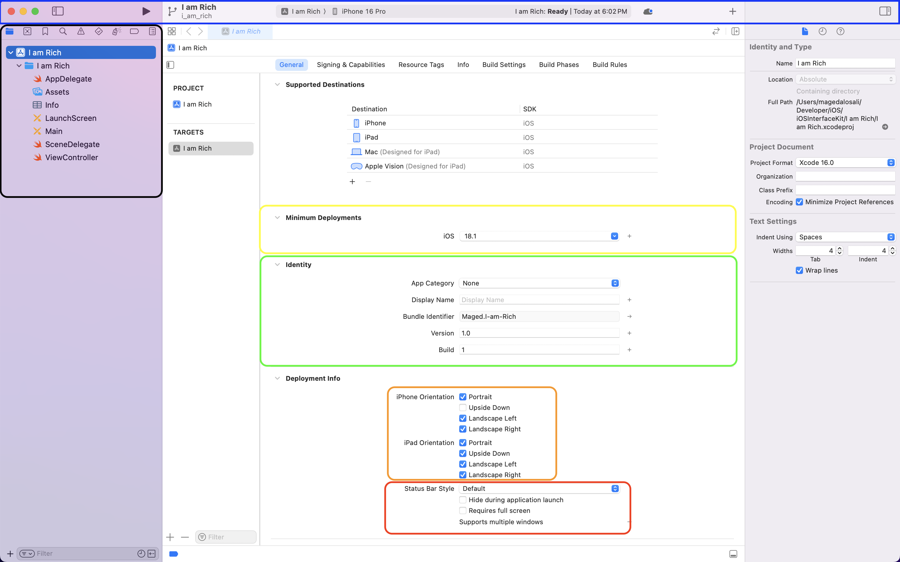

# I Am Rich APP

## Tutorial

Welcome to the I Am Rich App tutorial! This repository is dedicated to teaching you how to create a simple iOS application using UIKit, a powerful framework for building user interfaces.

Before diving into coding, we’ll start with an essential overview of Xcode—the integrated development environment (IDE) used for iOS app development.

### What is Xcode?

Xcode is Apple's official IDE for creating apps across all Apple platforms, including iOS, macOS, watchOS, and tvOS. It's a one-stop environment that provides everything you need to design, develop, and debug your applications.

#### Overview of Xcode

When you create a new project in Xcode, the first page you land on is the General Tab. This tab provides key details and settings for your application, as highlighted in the image below:

In the image, colored boxes highlight different sections of the General Tab to help you navigate and understand each part:

- **Yellow Box:**

    Represents the **minimum deployment iOS version**. This determines the lowest iOS version that can run your app. Devices with an older version of iOS will not be able to install the app.

- **Green Box:**

    Displays essential **app information**:

  - **App Category:** The type of app, such as games or utilities.
  - **Display Name:** The name of your app as it appears on the home  screen.
  - **Bundle Identifier:** A unique string to identify your app in the  App    Store.
  - **Version:** The release version of your app (e.g., 1.0).
  - **Build:** An internal version number for testing and updates.

- **Orange Box:**

    Defines the **device orientations** your app supports, such as portrait or landscape modes.

- **Red Box:**
Controls the **status bar style**, which affects the appearance of the status bar at the top of the device screen. For example, you can choose light or dark content for better visibility based on your app’s design.

The **last two boxes** are the ones you’ll use most frequently during development:

- **Blue Box:**

    This is the **Xcode Status Bar**. It includes:

  - **Run (Play)** and **Stop** buttons to launch or terminate the app.
  - The **device selector** to choose whether to run the app on a simulator or a physical device.
- **Black Box:**
    The **Navigator Pane**, which contains several tab bars. The most important is the **Project Navigator**, where you’ll:

  - **Develop:** Work with your app’s Swift files (code).
  - **Design:** Use Storyboard files to create the app’s user interface.

This structured overview of Xcode gives you the foundation to begin developing and designing your app effectively. More details about each section, especially the Navigator Pane tabs, will be explained in future sections.
